### `$ cat about.md`

> **Hello, I am a developer who loves to create new tools.**

### `$ cat stats.json`

```json
{
  "years_in_prod": 4,
  "convos_automated": "60k+",
  "npm_downloads": "380k+",
  "web3": ["ethereum", "solana", "nfts"],
  "ai": ["llms", "rag", "langchain"],
  "speaks": ["en", "hi", "gu"]
}
```

### `$ ls projects/`

| file | what it does |
| --- | --- |
| [`writewise.js`](https://github.com/Yash094/WriteWise) | Grammarly, but yours. AI writing assistant for every text field — your own key, zero servers. |
| [`x402music.ts`](https://x402music.live) | Music, paid for over HTTP. x402 micropayments — pay per listen. |
| [`x402-invoice.ts`](https://github.com/thirdweb-example/x402-invoice) | Invoices that settle themselves in stablecoins over x402. |
| [`crypto-mail.ts`](https://github.com/Yash094/crypto-mail) | Send crypto the way you send email. |
| [`token-marketplace.ts`](https://github.com/thirdweb-example/token-marketplace) | List, buy and sell tokens onchain. |
| [`quest-rewards.ts`](https://github.com/thirdweb-example/quest-rewards) | Complete quests, earn onchain rewards. |
| [`cyber-bird.ts`](https://github.com/thirdweb-example/cyber-bird) | Flappy-style arcade game with onchain twists. |
| [`memer-api.js`](https://github.com/Meme-Development/Memer-API) | Where it started. 380K+ npm downloads, peaking at 45K/month. |

### `$ which stack`

<p>


</p>

### `$ ./contact.sh`

<p>
<a href="mailto:hello@yashjoisar.me"></a>
<a href="https://www.linkedin.com/in/yash-joisar"></a>

</p>

<sub>process exited with code 0</sub>
